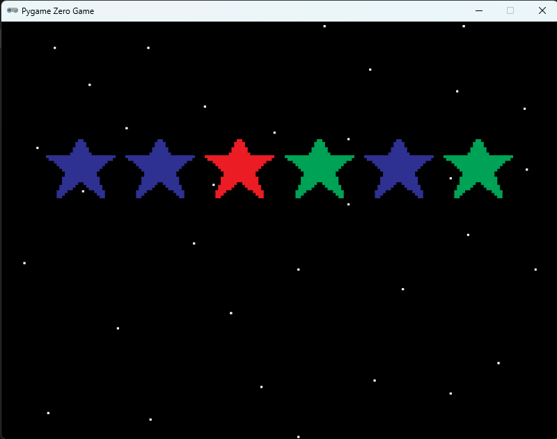

# Red-Star-Game

A simple arcade-style game built with [Pygame Zero](https://pygame-zero.readthedocs.io/) where your goal is to **click the red star** before it falls off the screen. But beware — you'll have to ignore other stars that try to distract you!



---

## Gameplay

- Click the **red star** as it falls down the screen.
- Each level adds more colored stars (decoys).
- If you click the wrong star or miss the red one, it's **Game Over**.
- Beat all levels to win!

---

## Getting Started

### Prerequisites

- Python 3.7+
- Pygame Zero

### Install Pygame Zero

```bash
pip install pgzero
````

### Run the Game

Make sure you're in the same directory as the game file, then run:

```bash
pgzrun red.py
```
Alternatively, you can double-click the file to run.
---

##  Project Structure

```
Red Star/
│
├── red.py              # Main game code
├── images/              # Folder containing star images
│   ├── red-star.png
│   ├── green-star.png
│   ├── blue-star.png
│   └── space.png        # Background image
└── README.md
```

---

##  Assets

The game uses PNG images for the stars and background. Make sure these images are present in the `images/` directory.

**Recommended filenames:**

* `red-star.png`
* `green-star.png`
* `blue-star.png`
* `space.png` (background)

---

## Features

* Multiple levels with increasing difficulty
* Simple click-to-play mechanics
* Win/lose conditions with restart option

---

